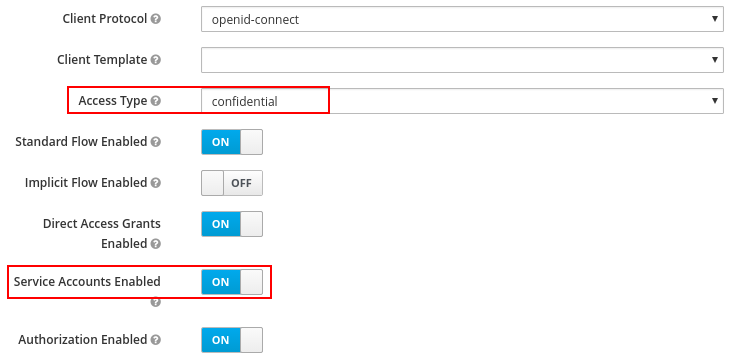
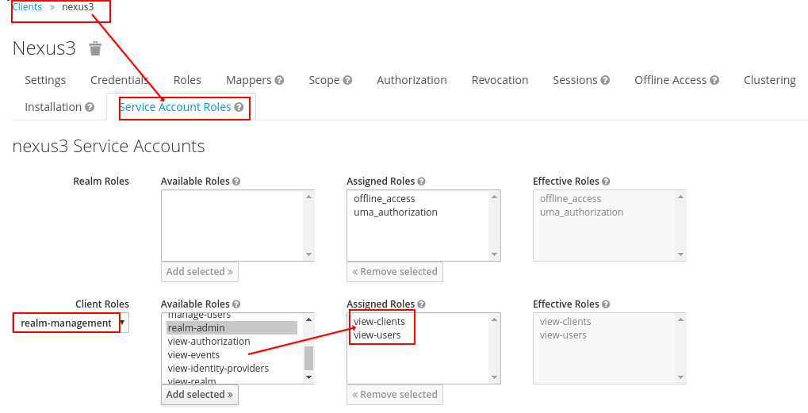
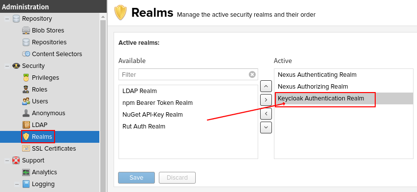
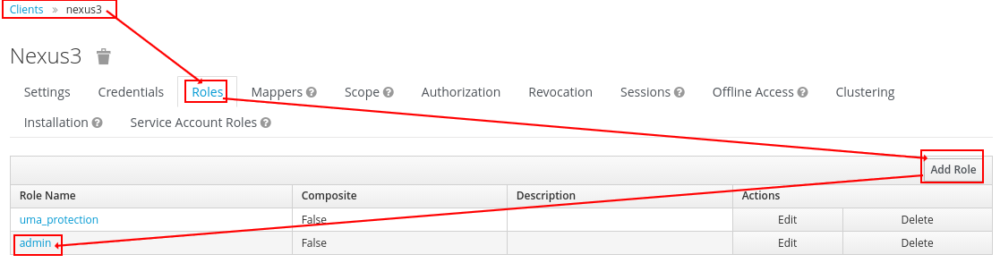
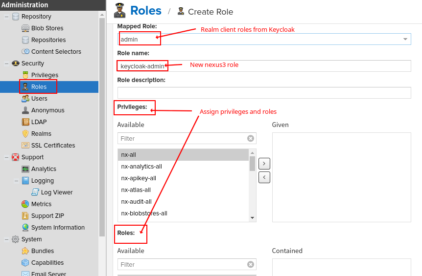
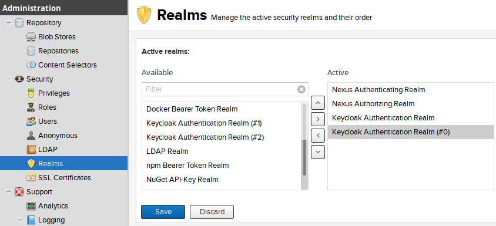
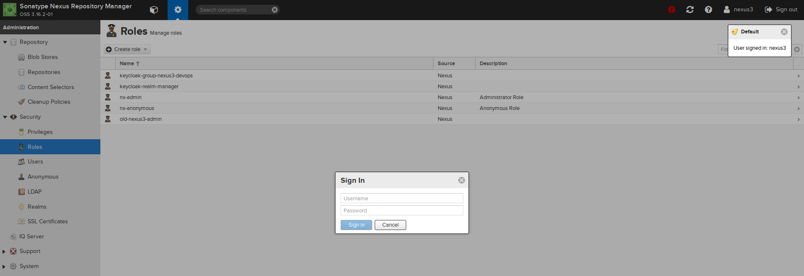

Nexus3 Keycloak Plugin
===============================

This plugin adds a Keycloak realm to Sonatype Nexus OSS and enables you to
authenticate with Keycloak Realm Users and authorize with Keycloak realm/client roles or groups.

It works with Nexus 3.x and Keycloak 3.x, Keycloak 4.x, Keycloak 5.x, Keycloak 6.x.

## Features

- Supports to map the **Realm-Roles**, **Client-Roles** and **Realm-Groups** of Keycloak.
- Supports to map multiple Keycloak realms.
- Supports Keycloak Single Sign On (SSO): sign-in and sign-out are all supported.

## Warning

If you are using the version 0.2.x of this plugin, and want to upgrade the plugin to 0.3.x,
you should create some new roles in Nexus3, becuase the new version of the plugin supports to
map the **Realm-Roles**, **Client-Roles** and **Realm-Groups** of Keycloak to the Nexus3 roles.

But don't worry about your data or the existing role-mappings, they will still work well.
The latest version of the plugin is compatible with the old version.
In the new version, the original Keycloak role/group name will be prepended with
`RealmRole:` (If it's a Realm-Role), `ClientRole:` (If it's a Client-Role) or `RealmGroup:` (If it's a Realm-Group).

If something goes wrong when you upgraded the plugin to the new version.
**DO NOT** save or update your configurations again, just go back to the old version and restart Nexus3,
then [create](https://github.com/flytreeleft/nexus3-keycloak-plugin/issues/new) an issue to report your problem.

## Development

Read the details in [develop/README.md](./develop/README.md).

## Prerequisites

* JDK 8+ is installed
* Apache Maven is installed
* Sonatype Nexus OSS 3.x is installed

## Installation

When Nexus gets downloaded and unzipped, there are typically two directories created:
* nexus-3.3.2-02
* sonatype-work/nexus3

To avoid confusion, the conventions of the Sonatype reference will be used in the following descriptions:
* nexus-3.3.2-02 will be referred to as **$install_dir**
* sonatype-work/nexus3 will be referred to as **$data_dir**

See [https://books.sonatype.com/nexus-book/reference3/install.html#directories](https://books.sonatype.com/nexus-book/reference3/install.html#directories)
for reference.

#### 1. Build the plugin

Build and install the into your local maven repository using the following commands:
```
git clone https://github.com/flytreeleft/nexus3-keycloak-plugin.git
cd nexus3-keycloak-plugin
mvn clean install
```

Note: You can download the compiled jar from the [release page](https://github.com/flytreeleft/nexus3-keycloak-plugin/releases)
directly, just choose the latest version.

#### 2. Copy all needed jars into nexus system folder

```
PLUGIN_VERSION=0.3.2-SNAPSHOT
jars="org/github/flytreeleft/nexus3-keycloak-plugin/$PLUGIN_VERSION/nexus3-keycloak-plugin-$PLUGIN_VERSION.jar"

for jar in $(echo $jars | sed 's/ /\n/g'); do
    mkdir -p $install_dir/system/$(dirname $jar)
    cp ~/.m2/repository/$jar $install_dir/system/$jar
done
```

#### 3. Add bundle to startup properties

Append the following line to *startup.properties* file found in `$install_dir/etc/karaf`.

Please replace `[PLUGIN_VERSION]` by the current plugin version.
```
mvn\:org.github.flytreeleft/nexus3-keycloak-plugin/[PLUGIN_VERSION] = 200
```

Or running the following command to do that automatically:
```
echo "mvn\\:org.github.flytreeleft/nexus3-keycloak-plugin/$PLUGIN_VERSION = 200" >> $install_dir/etc/karaf/startup.properties
```

#### 4. Configure Keycloak realm client

Login to your Keycloak, and navigate to
"[Choose your realm] -> Clients -> [Choose the existing client or create a new client, e.g. 'nexus3']".

Activate the `Settings` tab, choose `confidential` for `Access Type`,
then enable `Service Accounts Enabled` and `Authorization Enabled`,
click `Save` button to make configuration effective.



Then Activate the `Service Account Roles` tab, choose `realm-management` for `Client Roles`,
then select `view-realm`, `view-clients` and `view-users` in `Available Roles`,
click `Add selected` button to add them to `Assigned Roles`.



#### 5. Create keycloak.json

Create a *keycloak.json* file in `$install_dir/etc`.

Login to your Keycloak, and navigate to
"[Choose your realm] -> Clients -> nexus3 -> Installation -> [Choose 'Keycloak OIDC JSON' option]".

Copy the json content to `$install_dir/etc/keycloak.json`:
```
echo '{
  "realm": "default",
  "auth-server-url": "http://localhost:8080/auth",
  "ssl-required": "external",
  "resource": "nexus3",
  "credentials": {
    "secret": "a203feab-4bcf-4e73-b66e-05adc1da0da6"
  },
  "policy-enforcer": {}
}' > $install_dir/etc/keycloak.json
```

## Usage

#### 1. Activate Plugin

After installation you have to activate the plugin in the administration frontend.
You have to login with an administrative nexus account to do so. The default admin credentials are
* username: *admin*
* password: *admin123* (don't forget to change it!)

After login you can navigate to the realm administration.
Activate the `Keycloak Authentication Realm` plugin by dragging it to the right hand side.



#### 2. Map Keycloak Realm Client Roles to Nexus Roles

As a last step you have to map your Keycloak realm client roles to nexus internal roles.



A good starting point is mapping one Keycloak realm client role to *nx-admin* role,
so you can start managing Nexus with your Keycloak Login.
* Choose a Keycloak realm client role
* Think up a new unique name for the mapped role
* Add *nx-admin* to the contained roles



That's it. Now you can login your keycloak account.

## Development

#### 1. Start nexus with console

Move into your `$install_dir`. Edit the file `bin/nexus.vmoptions` to contain the following line
```
-Dkaraf.startLocalConsole=true
```

After that (re-)start nexus. It will then startup with an interactive console enabled.
(If the console doesn't show up, you may hit the Enter key after startup).
Your console should look like this afterwards:
```
karaf@root()>
```

#### 2. Install plugin bundle

Within the console just type
```
bundle:install -s file://[ABSOLUTE_PATH_TO_YOUR_JAR]
```

## Multiple Keycloak Realms

From the version 0.3.3, the plugin supports multiple Keycloak realms. You can map at least 4 different Keycloak realms' roles/groups to Nexus3.

If you want to enable this feature, just export the `Keycloak OIDC JSON` from the Keycloak realm to the file `$install_dir/etc/keycloak.{index}.json`,
and the `{index}` is a number which can be `0`, `1` or `2`.

Then, enable the corresponding Keycloak authentication realm in Nexus3:



Finally, you just need to map the new realm roles/groups to Nexus3 as the default one.

## Single Sign On (SSO)

From the version 0.3.4, you can login Nexus3 using Keycloak as SSO (Single Sign On) provider.

Before enable SSO, you need to put a reverse gateway (Nginx, Httpd etc.) before your Nexus3 server.

Then, the reverse gateway should do authentication via Keycloak and pass the HTTP header
`X-Keycloak-Sec-Auth: <username>:<access token>` to your Nexus3 server.

You can check the code of [develop/vhost.d/nexus3.conf](./develop/vhost.d/nexus3.conf) for more details.

Note, if you login as Administrator, and refresh the administration page, you will see the 'Sign in' window:



Don't worry about it, you still login, just close the window.

**Note**: After you login, you can click the logout button to logout and it will redirect to the Keycloak login page.

## Docker

You can execute command `bash docker/build.sh` to build your Nexus3 Docker image with this plugin.
The image is based on https://github.com/sonatype/docker-nexus3 which is running Nexus v3.19.1-01.
You can change the version of the base image or the version of this plugin in `docker/Dockerfile`.

After the image has been built, you should [prepare](#5-create-keycloakjson) your `keycloak.json`
and put it into the directory `docker/`, then execute command `bash docker/run.sh` to create and run a Nexus3 container.
If you want to change the default port/volume mappings, just edit `docker/run.sh` before running the container.

## License

[Apache License 2.0](https://www.apache.org/licenses/LICENSE-2.0)

## Contributing

[](https://github.com/flytreeleft/nexus3-keycloak-plugin/graphs/contributors)

Thanks to all contributors who helped to get this up and running.

## Thanks

* [nexus3-crowd-plugin](https://github.com/pingunaut/nexus3-crowd-plugin.git) by [@pingunaut](https://github.com/pingunaut)
* [keycloak-authz-client](https://github.com/keycloak/keycloak/tree/master/authz/client)
